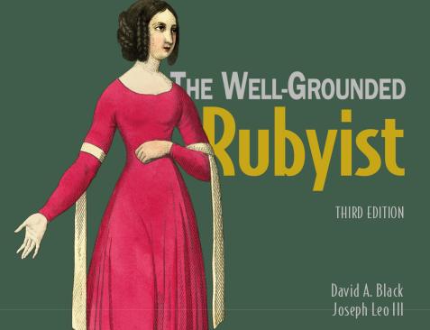

# The Well-Grounded Rubyist
### My Notes (in progress)

- This is nowhere near 100% complete - this release merely shames me into finishing.

### Contents:
1. Bootstrapping
2. Objects, Methods, Local Variables
3. Classes
4. Modules
5. Self
6. Control Flow Techniques
7. Essential Classes & Modules
8. Strings, Symbols, other Scalars
9. Collections & Containers
10. Enumerables
11. Regular Expressions
12. File I/O Operations (TODO)
13. Object Individualization
14. Callables & Runnables
15. Callbacks, Hooks, Runtime Introspection (TODO)
16. Functional Programming
